1  Marcos Cáceres García 

# Despliegue de una arquitectura EFS- EC2-MultiAZ. 

### Marcos Cáceres García 

### Creación de los Grupos de Seguridad para la EFS y las EC2. 

Para ello debemos ingresar a la sección de las EC2 y en la barra lateral pulsamos para crear un nuevo grupo de seguridad. 

Una vez allí al primero de ellos le llamaremos SGweb y lo configuraremos con HTTP abriendo el puerto 80 a todas las IP: 

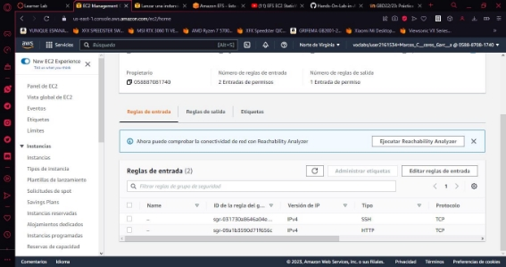

Para el SG de la EFS crearemos un grupo llamado SGefs y habilitaremos nfs con el puerto 2049 con el puerto abierto a todas las IP: 

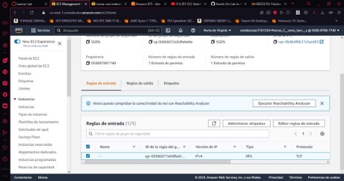

### Creación de las EC2. 

Para la creación de las EC2 usaremos Linux con el hardware t2.micro y para el par de claves usaremos vokey. 

Ahora debemos seleccionar nuestro grupo de seguridad SGweb y cambiar la zona de disponibilidad a la 1a para la primera máquina y 1b para la segunda: 

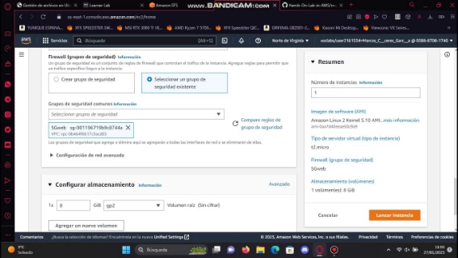

Y en los ajustes de usuario debemos copiar los comandos para instalar e iniciar apache: 

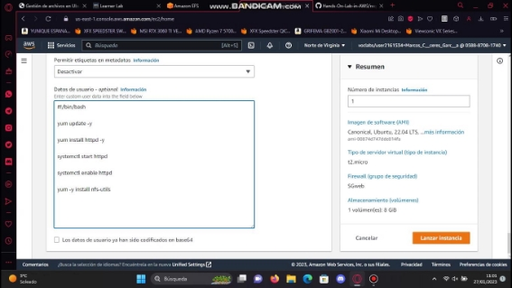

### Creación de la EFS. 

Para la creación de una EFS debemos dirigirnos a la sección de servicios y podemos buscar EFS en el buscador y nos aparecerá esta página: 

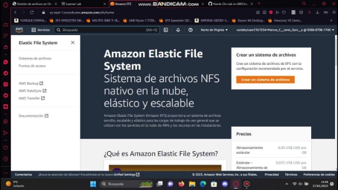

Ahora pulsamos para crear la EFS y elegimos el nombre y la zona de disponibilidad: 

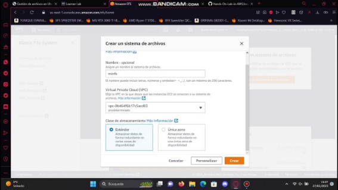

Una vez todo elegido pulsamos en crear y  nos dispondremos a configurar algunos parámetros adicionales. 

### Configuración de la EFS. 

Una vez la EFS esté operativa veremos la siguiente pestaña: 

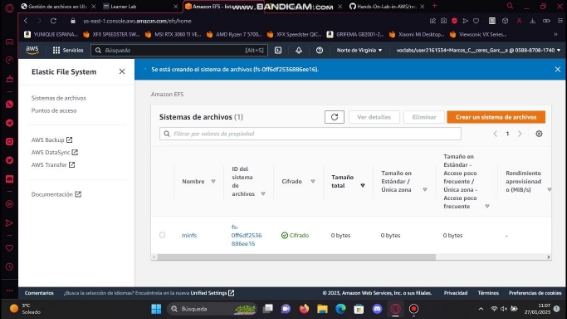

Una vez hecho esto pulsamos sobre ella y nos vamos en la sección de red y aquí ponemos que solo puedan acceder a la EFS las EC2 que se encuentren en el grupo de seguridad SGweb: 

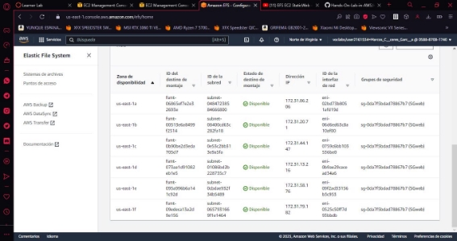

Esto impedirá que cualquier otra máquina fuera de este mismo grupo de seguridad acceda al contenido de nuestra EFS. 

### Conexión y configuración en terminal. 

Para empezar nos conectaremos a las EC2 haciendo click derecho sobre la EC2 y pulsando en conectar: 

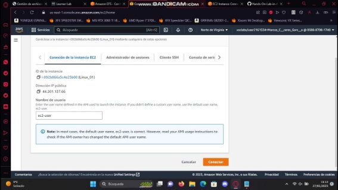

Una vez hecho esto ingresaremos a la terminal de las EC2 y para verificar que todo se encuentra en correcto funcionamiento escribiremos el comando que se ve en la imagen: 

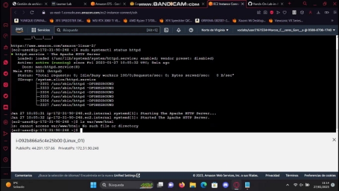

Ahora nos posicionaremos en la carpeta /var/www/html con el comando “cd /var/www/html” y después montaremos la EFS con el comando “sudo mkdir efs-mount”. 

Ahora debemos poner el comando con la id de nuestra EFS para que nuestra máquina pueda montarla sin problemas: 

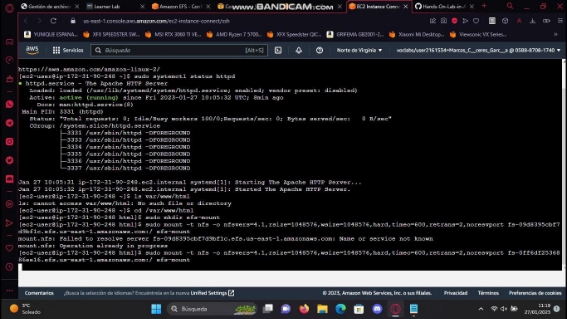

Ahora para verificar el correcto montaje ecribimos el comando “df -h”: 

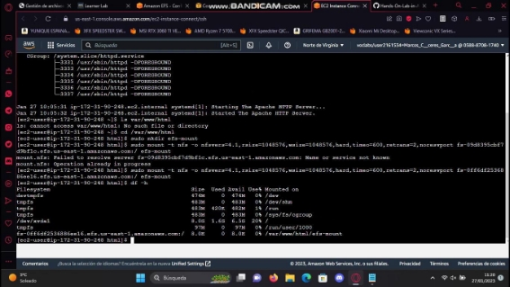

Ahora nos posicionamos en el directorio “efs-mount” con el comando “cdefs-mount”.

Ahora tenemos que descargar el archivo con el comando “wget” y la ruta del archivo, en este archivo viene el estilo de la página web el html el JavaScript,en general todo lo que necesitamos: 

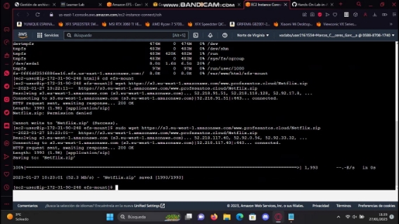

Ahora debemos descomprirmir el archvio “Netflix.zip” con el comando “unzip” y veremos  todos los archivos que contenía el archivo .zip. 

Podemos visualizar el contenido del html con el archivo que se ve en la imagen: 

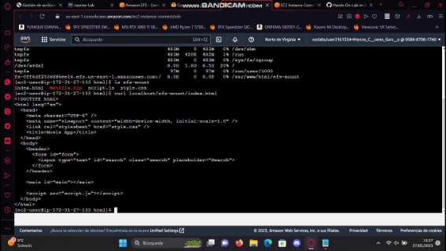

Para verificar que toda la página funcióna debemos escribir la IP pública de alguna de las dos máquinas y debemos ver la siguiente página: 

Ahora lo que queremos es que solo con poner la ip de nuestra máquina aparezca la página, es decir, que no haga falta poner la ruta completa, para ello, ingresamos en el archivo “/etc/httpd/conf/httpd.conf” y editaremos la línea del archivo DocumentRoot "/var/www/html/efs-mount": 

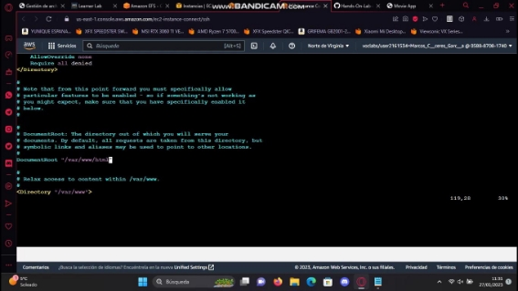

Una vez modificado y guardado el archivo nos debería dirigir a la página solamente poniendo la IP pública de cualquiera de las dos máquinas. 

### Creación del Balanceador de Carga. 

Para la creación del balanceador de carga debemos de crear una nueva máquina EC2 en este caso solo debemos configurar el par de claves. 

Una vez nos conectemos a la máquina por medio del método antes mencionado debemos instalar apache con el comando “sudo apt install apache2” y una vez instalado podremos ver la siguiente pestaña: 

Cuando hayamos verificado que nuestra máquina funciona perfectamente debemos comenzar a instalar una serie de servicios por medio de las líneas :  

a2enmod proxy a2enmod proxy\_http a2enmod proxy\_ajp a2enmod rewrite a2enmod deflate a2enmod headers a2enmod proxy\_balancer a2enmod proxy\_connect a2enmod proxy\_html 

a2enmod lbmethod\_byrequests Una vez instaladas todos los servicios debemos reiniciar apache, para ello escribimos el comando “sudo systemctl restart apache2”. 

Ahora debemos ingresar al archivo “sudo nano /etc/apache2/sites-enabled/000-default.conf” y buscaremos la línea “Virtual Host”, justo arriba escribiremos el siguiente comando sustituyendo HTTP-server por las IP de nuestras máquinas: 

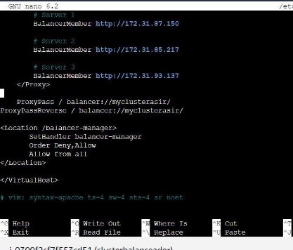

Una vez escrito, abajo debemos pegar la siguiente línea para acabar de configurar el balanceador de carga: 

ProxyPassReverse / balancer://clusterasir/ <Location /balancer-manager> 

`       `SetHandler balancer-manager 

`       `Order Deny,Allow 

`       `Allow from all 

</Location> 

Una vez guardemos y cerremos el archivo y reiniciemos la máquina, podemos verificar que todo funciona bien poniendo la IP del balanceador de carga+balancer-manager. 

Y ahora sí podemos poner la IP del balanceador de carga y se nos abrirá la página web que no esta siendo ejecutada por nuestros balanceador si no por las máquinas. 
